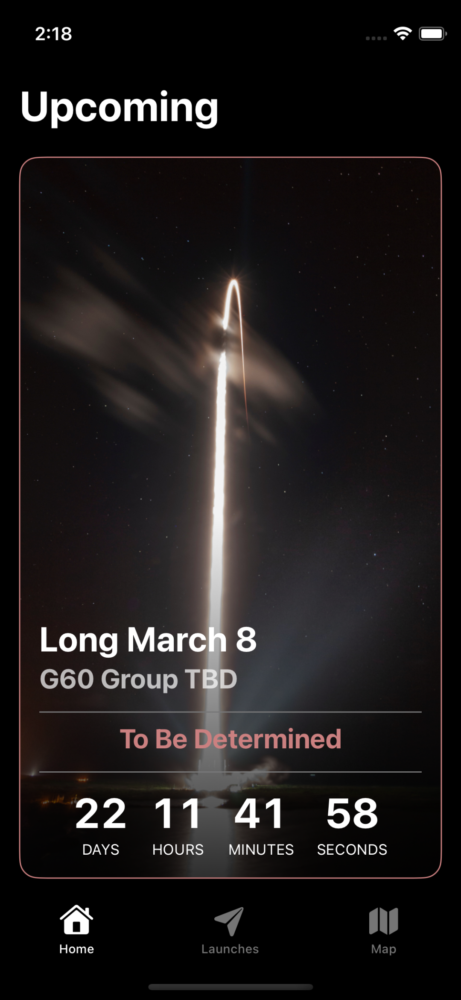
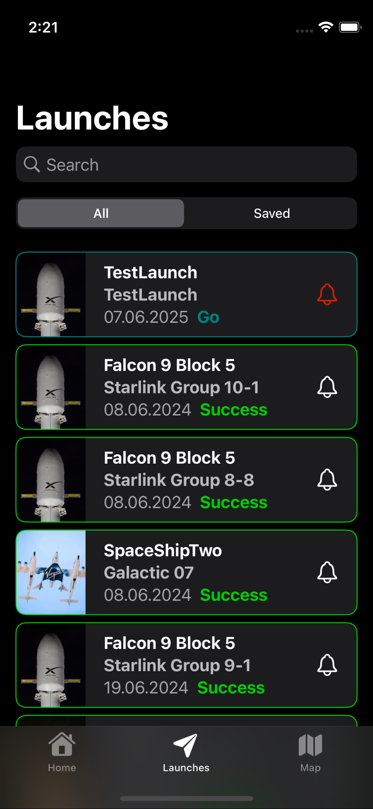
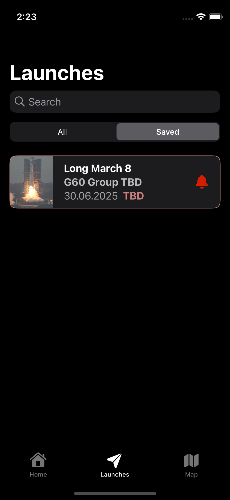
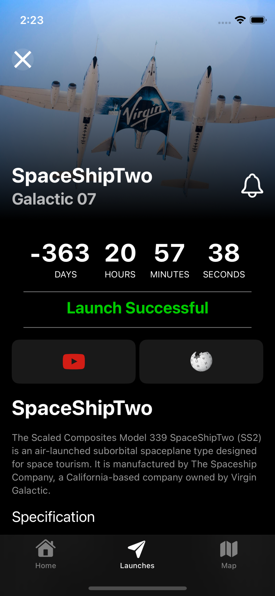
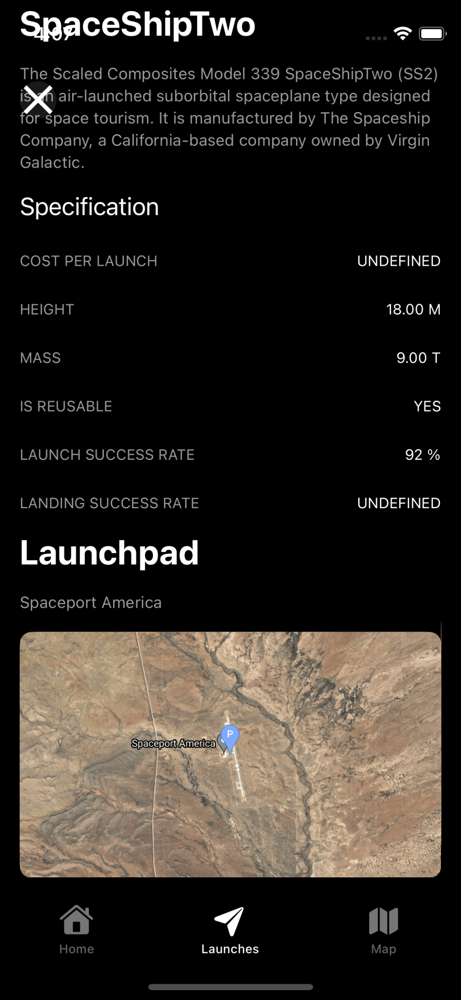

# 🚀 SpaceApp

Aplikácia určená na **sledovanie a upozorňovanie na odlety vesmírnych rakiet**.

  
  
  
  
  

## Funkcie:

### Zobrazenie nadchádzajúcich štartov:
Používateľ si môže prechádzať chronologický zoznam najbližších štartov rakiet.

### Zobrazenie detailov misie:
Po kliknutí na štart sa zobrazia detaily o misii, rakete, spoločnosti, dátume a mieste štartu.

### Nastavenie upozornenia:
Používateľ si môže nastaviť notifikáciu pre konkrétny štart.

### Zobrazenie mapy štartov:
Aplikácia zobrazuje interaktívnu mapu s miestami štartov.

### Vyhľadávanie štartov:
Po kliknutí do vyhľadávacieho poľa na správnej obrazovke, sa dá vyhľadávať štarty poľa mena.

---

# Štruktúra projektu

## Application

Obsahuje vstupné miesto aplikácie.

## Extension

Pomocné rozšírenia (`extension`) pre systémové typy a knižnice:

* **Date** – rozšírenia pre prácu s dátumami.
* **ReactorKitExtensions** – rozšírenia špecificky pre ReactorKit.

## Managers

Triedy zodpovedné za správu rôznych aspektov aplikácie:

* **Cache** – logika pre ukladanie dát do cache.
* **Navigation** – navigačný manažér.
* **Notification** – manažér pre push/notifikácie.
* **Request** – manažér pre komunikáciu s API.

## Models

Dátové štruktúry a modely:

* **Response** – Tiredy reprezentujúce odpovede zo servera.

## Resources

Súbory ako obrázky, farby, lokalizácia.

## Screens

Obsahuje obrazovky aplikácie (view + reactor):

* **Home** – hlavná úvodná obrazovka.
* **Launches** – zoznam odletov, paginovaný.
  * **Detail** – detail konkrétneho odletu.
* **Map** – mapa s vizualizáciou štartov.
* **TabBar** – konfigurácia spodnej lišty s jednotlivými tabmi (Home, Launches, Map...).

## UI

Obsahuje všeobecné zdieľané UI komponenty ako štýly pre tlačidlá.

## Views

Znovupoužiteľné View. Nemajú vlastnú logiku (reaktory), len vizuálnu reprezentáciu.

# Zdroje
[Swift clean architektúra](https://medium.com/@walfandi/a-beginners-guide-to-clean-architecture-in-ios-building-better-apps-step-by-step-53e6ec8b3abd)
[Swift dokumetácia](https://docs.swift.org/swift-book/documentation/the-swift-programming-language/)
[The Space Devs Launch Library API](https://thespacedevs.com/llapi)
